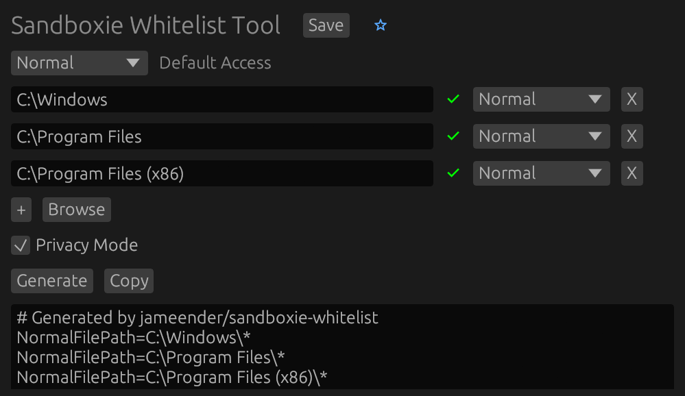

<div align="center">
  <h1>Sandboxie Whitelist</h1>
  <h4>Generate Whitelists for Sandboxie Plus ✨</h4>
</div>

<br>

A GUI tool built with Rust and [egui](https://github.com/emilk/egui) to generate [Sandboxie Plus](https://sandboxie-plus.com) access rules, simulating the premium "Privacy Mode" feature for non premium users.

It provides a user friendly graphical interface to define *allowed* files; it then automatically generates the necessary Sandboxie Plus configuration rules (`.ini` format) that achieve a similar outcome: blocking files by default and only permitting access to the files you've explicitly whitelisted.

This allows users without a premium membership to use a whitelist sandboxing approach.

 

## Installation
1. Clone the repository
```sh
git clone https://github.com/jameender/sandboxie-whitelist
cd sandboxie-whitelist
```
2. Compile and run the project
```sh
cargo run --release
```

**⚠️ Warning:**
Always test carefully after applying new rules; start with a minimal whitelist and add permissions gradually.
The generation is also possibly not perfect; so do not rely on the output by itself, always double check.
